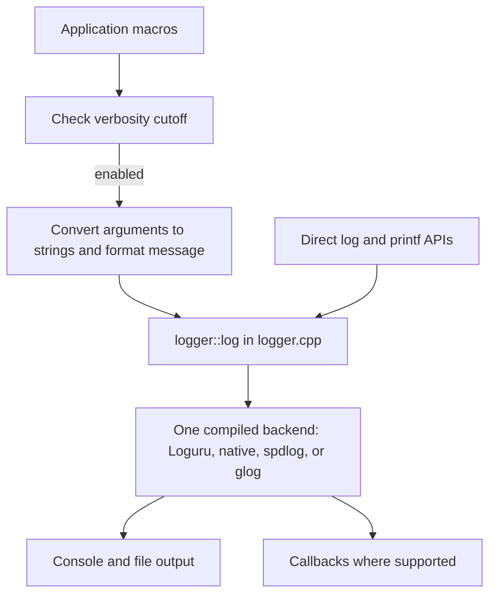

# Logging design

Reviewed against repository revision `78fc37f` on 2026-09-25. The project
currently declares version **1.0.0** in [CMakeLists.txt](../CMakeLists.txt).
This document consolidates the architecture review, design decisions, backend
contract, refactoring plan, testing strategy, and compatibility guidance.

**Status:** current behavior is described separately from proposed changes.
All implementation phases below are **planned**, not completed. This document
does not establish a v2 release or change runtime behavior. Review findings
come from source inspection; runtime reproductions remain phase 1 work.

The library has a useful foundation: compile-time backend selection, a common
static facade, lazy macro arguments, and owned callback message strings. The
priority is to make callback lifetime, filtering, file handling, and lifecycle
behavior consistent before extracting backend files.

## Contents

- [Current architecture and review](#current-architecture-and-review)
- [Target design and rationale](#target-design-and-rationale)
- [Proposed backend contract](#proposed-backend-contract)
- [Implementation phases](#implementation-phases)
- [Verification strategy](#verification-strategy)
- [Current API and compatibility](#current-api-and-compatibility)

## Current architecture and review

### Implemented architecture

Logging is a compiled C++ library with public macros and a static
`logging::logger` facade. CMake or Bazel selects one of LOGURU (default), NATIVE,
SPDLOG, or GLOG. There is no runtime backend factory or common virtual backend
interface. Conditional branches in `include/logger/logger.cpp` provide the
implementations.



| Responsibility | Current source |
|----------------|----------------|
| Umbrella header | [include/logging.h](../include/logging.h) |
| Facade, logging macros, callback payload, scope RAII | [logger.h](../include/logger/logger.h) |
| Backend state, dispatch, sinks, scope bookkeeping | [logger.cpp](../include/logger/logger.cpp) |
| Numeric verbosity contract | [logger_verbosity_enum.h](../include/logger/logger_verbosity_enum.h) |
| Argument conversion and formatting | [string_util.h](../include/util/string_util.h), [string_util.cpp](../include/util/string_util.cpp) |
| Throw/check policy | [exception.h](../include/util/exception.h), [exception.cpp](../include/util/exception.cpp) |
| Explicit and exception stack traces | [back_trace.h](../include/logger/back_trace.h), [back_trace.cpp](../include/logger/back_trace.cpp) |

Implementation files currently live under `include/`. Logging macros are in
`logger.h`; `common/logging_macros.h` contains shared compiler/configuration
helpers. No `src/backend/` directory exists yet.

### Message flow and formatting

`LOGGING_LOG_INFO`, `LOGGING_LOG_WARNING`, `LOGGING_LOG_ERROR`, and the generic
`LOGGING_LOG(INFO, ...)` compare verbosity with
`logger::get_current_verbosity_cutoff()` before evaluating format arguments.
Conditional macros evaluate the condition first. Disabled calls still perform
a cutoff query and branch; their cost depends on the selected backend.

Enabled calls use `strings::format(std::string_view, const Args&...)`. Each
argument is converted to a string, generally through stream insertion, with
special handling for floating-point values. The compiled `strings::vformat`
then uses fmt by default, or `std::vformat` when configured. The std path falls
back to limited placeholder substitution above eight arguments.

Consequences:

- `{}` substitution is the portable public format contract. Original numeric
  types are lost before formatting, so `{:x}` and `{:.2f}` are not supported as
  numeric formatting of the original arguments.
- Format strings are checked at runtime, not through `fmt::format_string`.
  Formatting can allocate and throw; enabled logging is not allocation-free.
- `logger::log` takes already formatted text. The temporary string created by
  a macro lives through that synchronous call. Adapters must copy it before
  retaining it.
- `log_f`, `start_scope_f`, and the scope RAII constructor remain printf-style
  APIs. They are not marked deprecated.
- The spdlog adapter constructs a synchronous `spdlog::logger`; this library
  does not configure an asynchronous queue.

### Verbosity and fatal behavior

The library declares its own enum, using values aligned with Loguru:

| Name | Value |
|------|-------|
| `VERBOSITY_INVALID` | -10 |
| `VERBOSITY_OFF` | -9 |
| `VERBOSITY_FATAL` | -3 |
| `VERBOSITY_ERROR` | -2 |
| `VERBOSITY_WARNING` | -1 |
| `VERBOSITY_INFO` | 0 |
| `VERBOSITY_TRACE`, `VERBOSITY_MAX` | 9 |

Lower values are more severe. An ordinary message passes the macro filter
when `message_verbosity <= cutoff`. `OFF` and `INVALID` are control values,
not message severities. There is no `VERBOSITY_DEBUG`; positive numeric
verbosity is available through `LOGGING_VLOG_IF` and numeric scope macros.
`LOGGING_LOG_DEBUG(INFO, ...)` is a build-mode guard removed under `NDEBUG`.

`LOGGING_LOG_FATAL` currently uses the ordinary filter too. With cutoff OFF,
the macro can skip both output and termination. A dispatched fatal record
normally aborts, but callback/formatting failures complicate that path.
`LOGGING_THROW` in LOG_FATAL mode has a separate `std::abort()` fallback.
Unconditional fatal termination is a proposed contract, not a current macro
guarantee.

### Backend differences

This table describes the adapters in this repository, not every capability
offered by the underlying libraries.

| Behavior | Loguru | Native | spdlog | glog |
|----------|--------|--------|--------|------|
| Macro cutoff | Maximum active destination cutoff | Global atomic cutoff | Logger-wide mapped level | Global glog flags |
| Independent verbose file/callback with quieter stderr | Supported by destination cutoff | Blocked by global cutoff | Blocked by logger level | File verbosity argument ignored |
| Custom callbacks | Bridge to Loguru | Internal registry | Callback sinks | Registration is a no-op |
| Callback log invocation | Under recursive Loguru lock | Outside I/O lock | Under sink locks | Unsupported |
| Callback flush hook | Forwarded | Called under I/O lock | Stored but never invoked | Unsupported |
| File mode and stop | Delegated to Loguru | Append/truncate; remove by path | Append/truncate; remove tracked sink | Mode ignored; stop only flushes and changes console routing |
| Positive verbosity | Numeric | Numeric | Collapsed to trace | VLOG levels |
| Thread-name storage | Thread-local bridge | Thread-local | Thread-local getter, shared output pattern | Thread-local getter |

The facade provides common method names, not full behavioral equivalence.
`Message` owns strings, but a callback receives a borrowed `const Message&`;
retaining a record requires copying it. `user_data` is a raw pointer, with no
ownership protection in the current registry.

### Scope and configuration lifecycle

Function scopes use a movable `logger::log_scope_raii`. Loguru delegates to
its RAII scope object. Other backends emit entry/exit text; native and spdlog
also report duration. Manual named scopes use global maps keyed by thread ID,
with a mutex around map lookup/erase and per-thread vectors used afterward.

The earlier draft claimed that map rehash invalidates references to mapped
vectors. That diagnosis is incorrect: `std::unordered_map` rehash invalidates
iterators, not references to elements. The code nevertheless has lifecycle
and reentrancy complexity, and unmatched scopes can persist after thread exit.
A thread-local stack is proposed for simpler ownership, with tests for cleanup
and recursive logging during scope destruction.

Configure signal handling before `init()` on the main thread. The existing
`set_enable_unsafe_signal_handler(bool)` wraps a plain public boolean; it does
not enforce initialization timing. Per-signal public booleans are passed to
Loguru. Glog uses the master switch; native and spdlog install no signal
handlers here. There is no uniform shutdown API or general concurrent
reconfiguration guarantee. Serialize initialization and configuration in the
application until those contracts are implemented and tested.

`LOGGING_THROW("message {}", value)` and failed `LOGGING_CHECK` throw
`logging::exception` in THROW mode. LOG_FATAL mode logs and aborts. The default
is compiled in; `LOGGING_EXCEPTION_MODE` is read lazily on first mode access
unless the runtime setter has already initialized it. Backtraces are available
explicitly and during exception construction; ordinary log messages do not
automatically capture a stack.

### Review findings and priorities

These findings follow source inspection; this documentation review did not
execute runtime reproductions. Function names identify the relevant locations
in [logger.cpp](../include/logger/logger.cpp).

| Priority | Finding and trigger | Design response |
|----------|---------------------|-----------------|
| P1 | A spdlog callback that emits an enabled log re-enters `dist_sink_mt`/`callback_sink_mt` locks and can deadlock. Native `on_flush`/`on_close` also run under `g_io_mutex`. | Own callback dispatch outside backend locks; define recursion rules for all hooks. |
| P1 | Native logging snapshots raw `user_data`, unlocks, then invokes it. Concurrent `native_remove_callback` can call `on_close` and free that data first. | Keep registration state alive until all snapshots finish; defer close. |
| P1 | OFF cutoff suppresses `LOGGING_LOG_FATAL` before backend dispatch. | Separate fatal termination from ordinary filtering and test it in subprocesses. |
| P2 | Native/spdlog global cutoff rejects records wanted by a more verbose file or callback. | Derive the frontend cutoff from all active destinations and filter each destination independently. |
| P2 | `set_thread_name` in spdlog embeds the caller's name in a shared pattern; other threads can print that name. | Capture producer metadata in each record; test emitted output, not just getters. |
| P2 | Re-registering a spdlog callback ID or file path overwrites the map entry but leaves the old sink attached. Removal then removes only the latest sink. Native callback replacement omits the old close hook. | Define replacement as retire-old/install-new with exactly-once cleanup. |
| P2 | spdlog stores `on_flush` without invoking it; glog silently ignores callbacks and several file arguments. | Implement parity or expose explicit unsupported capability/error results. |
| P2 | `start_scope_f` outside Loguru logs without pushing a named scope; a matching `end_scope` reports a mismatch. | Share bookkeeping across formatted and unformatted scope entry. |
| P2 | Shared configuration includes ordinary globals such as `g_requested_stderr_verbosity` and signal booleans. | Define supported concurrent operations and synchronize them; avoid blanket thread-safety claims. |
| P2 | CMake installs artifacts but does not install `LoggingTargets` or generate `LoggingConfig.cmake`. | Add and test a relocatable package before advertising `find_package` integration. |

The spdlog lock behavior is visible in the vendored
[base sink](../ThirdParty/spdlog/include/spdlog/sinks/base_sink-inl.h),
[distribution sink](../ThirdParty/spdlog/include/spdlog/sinks/dist_sink.h), and
[callback sink](../ThirdParty/spdlog/include/spdlog/sinks/callback_sink.h).

## Target design and rationale

### 1. Retain compile-time backend selection

**Existing; retain.** Select exactly one backend with `LOGGING_BACKEND` in
CMake or `--define=logging_backend=...` in Bazel. Preserve the existing
`LOGGING_HAS_LOGURU`, `LOGGING_HAS_NATIVE`, `LOGGING_HAS_SPDLOG`, and
`LOGGING_HAS_GLOG` definitions.

**Proposed boundary:** one private header declares nonvirtual adapter
functions; exactly one selected implementation defines those functions.
A factory returning `unique_ptr<BackendInterface>` would introduce runtime
polymorphism. It cannot also guarantee direct calls merely because the factory
is selected at build time. No factory or abstract base is needed here.

Backend libraries can still use virtual sink dispatch internally. Avoid
claiming that the complete logging path has no virtual calls or fixed cost.
Reconsider runtime selection only if a concrete application needs it.

### 2. Keep formatting in the frontend; preserve its dependency boundary

**Existing; retain initially.** Macros gate evaluation, then the string utility
converts arguments to strings and calls a compiled formatter. Public templates
do not expose fmt types. Backend adapters receive already formatted text and
may format presentation metadata such as severity and source location.

This design supports streamable application types and limits header coupling,
but loses original argument types and can allocate several strings. It does
not provide compile-time format checking or general numeric format specifiers.

**Deferred:** a typed fmt/std-format API. Adopting it requires an explicit
choice about public dependencies, custom streamable types, runtime format
strings, language standard, and the existing std-format option. Do not change
this as an incidental consequence of splitting backend files. Keep printf
entry points until a tested replacement and actual deprecation policy exist.

### 3. Specify verbosity in library terms

**Existing values; proposed uniform filtering.** Preserve enum values and the
rule `message_verbosity <= destination_cutoff`. OFF/INVALID are not messages.
The current enum is already declared by Logging, though its numeric values
match Loguru. There is no need to introduce a new public severity enum.

The frontend cutoff should be the maximum cutoff of enabled destinations,
with each destination applying its own exact numeric filter. Disabling the
console must not disable files or callbacks. Backend conversion follows that
filter, preserving distinctions between numeric levels even when spdlog maps
several levels to trace.

**Proposed fatal policy:** fatal operations always terminate, including with
all ordinary destinations disabled. Diagnostic output and flush are best
effort; their failures must not let execution continue. This is an observable
correction to today's filtered fatal macro and needs release notes.

### 4. Centralize callback lifetime and reentrancy

**Proposed.** A common registry owns shared registration state. Log/flush
operations snapshot owning handles; removal retires a registration, and its
close hook runs once after the last in-flight operation completes. No user
hook executes while a registry, I/O, or backend sink lock is held.

Copying raw pointers under a lock is insufficient: removal may destroy the
pointed-to state before invocation. Removal from inside the callback must not
wait for itself. The [backend contract](#proposed-backend-contract) defines deferred
close and snapshot semantics.

Nested logging may write to destinations but skips callback dispatch while
already executing any user hook on that thread. This bounds recursion rather
than merely replacing one deadlock with infinite callback invocation. Hook
exceptions must be contained and reported through a nonrecursive fallback.
Callbacks may run concurrently on different threads; user state still needs
its own synchronization.

### 5. Use thread-local scope ownership and per-record metadata

**Proposed.** Replace maps keyed by thread ID with thread-local stacks. Benefits
are simpler cleanup, no map lookup lock, and no stale state from recycled
thread IDs. The old claim that unordered-map rehash invalidates references was
incorrect; this change must not be justified as a demonstrated rehash crash.

Detach an exiting scope from its container before emitting exit output or
running a backend destructor that can log. Thread-local storage alone does
not make recursive mutation of a vector safe. Scope cleanup at thread exit
must not access destroyed process state or let exceptions escape destructors.

Capture the producer's thread name per record. Never put one thread's name in
a shared spdlog pattern. Preserve public `Message` layout during initial
extraction; adding public metadata is a separate ABI decision.

### 6. Encapsulate configuration without pretending existing state is atomic

**Partly existing; extend deliberately.** The master signal-handler setter
already exists, while per-signal booleans remain public. Configure signals
before initialization. A future options API should validate that phase and
use enum names such as `abort_signal`, avoiding collision with platform
`SIGABRT`-style macros.

Removing public data or replacing it with accessors can break both source and
binary compatibility. Deprecation must be implemented and released before
any migration guide claims warnings or removal dates. Keep process-wide
signal ownership explicit; ordinary logging APIs are not signal-safe.

### 7. Extract modules after correctness fixes

**Proposed.** Keep the facade and public headers; move common state to `src/`
and each adapter to `src/backend/`. Select source files explicitly in CMake
and Bazel. Prefer one clear source-selection list per build system; separate
CMake subdirectories are optional, not an architectural requirement.

Current CMake recursively globs the tree with exclusions; Bazel combines
explicit logger files with globs. Explicit lists improve build review and
prevent accidental inclusion of scratch/generated sources. Preserve exports,
transitive dependencies, and Windows shared-library definitions during moves.

### 8. Make unsupported behavior and errors visible

**Proposed.** Adapter capabilities and status results describe unsupported
file operations or initialization options. Common callbacks should work
regardless of the selected backend. Do not silently treat glog no-ops as full
support for the facade contract.

Define duplicate IDs, file-open failures, repeated initialization, flush, and
removal before implementation. Flush means draining library buffers, not
filesystem durability. Avoid promising asynchronous delivery or fsync semantics.

### 9. Keep this refactor focused

**Retain current scope.** Text messages, source metadata, exceptions, and
backtraces remain supported. Structured key/value fields, runtime backend
switching, asynchronous queues, and new public shutdown/error APIs require
separate proposals. There is no approved v2/v3 release schedule or evidence
for fixed nanosecond performance targets.

See the [refactoring plan](#implementation-phases) for acceptance gates and the
[testing strategy](#verification-strategy) for measurements.

## Proposed backend contract

### Ownership of responsibilities

| Layer | Responsibility |
|-------|----------------|
| Public macros and facade | Source location, lazy evaluation, existing signatures |
| Common core | Formatting, numeric filtering, callback registry, record metadata, scopes, fatal policy |
| Selected adapter | Backend initialization, console/file presentation and output, backend flush |
| Application | Callback state synchronization, startup configuration, external resource lifetime |

The common core calls one compiled adapter using nonvirtual functions. Backend
libraries can use their own internal dispatch. No runtime factory or owning
base-class pointer is required.

### Internal interface sketch

The following types and names are proposed, not available headers. File/sink
handles and status values stay private to preserve public API compatibility.

```cpp
namespace logging::detail::backend {
struct record_view {
    logger_verbosity_enum verbosity;
    std::string_view filename;
    unsigned line;
    std::string_view message;
    std::string_view thread_name;
};

enum class status { ok, unsupported, invalid_argument, io_error };
struct capabilities;
struct init_options;
struct file_handle;

capabilities query_capabilities() noexcept;
status initialize(const init_options& options);
status write_console(const record_view& record);
status open_file(std::string_view path, logger::file_mode mode,
                 file_handle& result);
status write_file(file_handle& file, const record_view& record);
status close_file(file_handle& file);
status flush();
} // namespace logging::detail::backend
```

Exactly one adapter implementation supplies this interface in a build. The
interface must be compile/link checked for each backend. Views are borrowed
only for the duration of a call; any retained record must own copies.

This sketch assumes destination-specific writes. If glog cannot provide those
semantics through its native API, its adapter must implement an alternative
file sink or return `unsupported`. That decision is a gate before extraction,
not permission to silently ignore arguments.

### Filtering and routing

1. Validate message verbosity. OFF and INVALID are configuration/sentinel
   values and must not be emitted as ordinary records.
2. Maintain an effective cutoff equal to the maximum cutoff of enabled
   destinations; use OFF when none are enabled.
3. Macros skip formatting and argument evaluation above that cutoff.
4. Route a record only to destinations with `record.verbosity <= cutoff`.
5. Preserve the original numeric value before mapping it to backend severity.
6. Fatal operations bypass ordinary filtering and terminate even when output
   fails. Avoid using a backend's terminating severity before common callback
   and best-effort flush work is complete.

A concurrently changed cutoff may affect which configuration a racing call
observes. Once a configuration operation returns, calls begun afterward must
observe that change. An early cutoff check must never become a permanent
stale value that hides newly registered destinations.

### Callback API compatibility

Keep the existing public signature:

```cpp
using log_handler_callback_t =
    void (*)(void* user_data, const logger::Message& message);
```

`Message` contains `verbosity`, `filename`, `line`, `preamble`, `indentation`,
`prefix`, and `message`. Its strings are owned, but the reference is borrowed
until the handler returns. Copy the message or strings to retain them.
There is no public `severity` or `thread_name` field today.

### Callback lifecycle

The target registry uses owning registration handles, not snapshots containing
only a callback pointer and raw `user_data`.

- Registration copies the ID and stores handler, data, thresholds, close and
  flush hooks in one lifetime-managed entry.
- Log and flush operations acquire snapshots under the registry mutex, then
  release every internal lock before invoking user code.
- Removal erases the entry from future snapshots. Existing snapshots may still
  invoke it after removal returns. The close hook runs exactly once, after all
  retained snapshots finish, outside all internal locks.
- Replacing an ID retires the old entry using the same rule and installs the
  replacement. It must not leak an old sink or skip its close hook.
- Self-removal is nonblocking. A callback cannot wait for its own completion.
- When no close hook owns cleanup, the application must retain `user_data`
  until producers and in-flight callbacks have quiesced. Removal alone is not
  permission to free externally owned data.
- Closing shared registration state must be deferred until outside any registry
  lock, including the last-reference case during replacement or removal.

During any user hook on a thread, nested logs may reach console/files but do
not dispatch user hooks again. Nested flush skips user flush hooks; operations
that retire entries defer their close hooks until the current hook unwinds.
The implementation needs an explicit per-thread dispatch guard and deferred
cleanup queue, not just a recursive mutex.

User hooks may execute concurrently on different producer threads. The registry
does not make user data thread-safe. Catch hook exceptions at the boundary and
use a nonrecursive fallback diagnostic; never throw from deferred cleanup or
scope destructors. Fatal termination must survive a failing handler.

### Files, flush, and errors

File registration should validate a path, create parents where supported, and
report open errors. Reusing a path replaces the previous sink, applying the
new append/truncate mode once. Open the replacement successfully before
retiring the active sink when possible; document truncation side effects.

Stopping a file removes it from future routing and lets existing operations
finish before flushing/closing it. Different textual paths are distinct keys;
filesystem canonicalization or alias deduplication is not implied.

`flush()` flushes current output buffers and invokes snapshot flush hooks
outside locks. It does not promise fsync durability or an asynchronous queue
barrier. With concurrent producers, it is not a global stop-the-world boundary.

Adapter errors must not recursively call the public logger. The public facade's
translation of `status` into existing return types, exceptions, or a future
error handler is an explicit design gate: existing void methods cannot claim
a new status-returning contract without an API change.

### Scopes and initialization

Common scope storage is thread-local. Manual scope entry, including
`start_scope_f`, must push matching state regardless of whether entry output
is filtered. Mismatch diagnostics must not corrupt the stack. Move completed
state out before emitting exit output; cleanup cannot throw.

Initialization and signal configuration occur during serialized startup.
Repeated initialization behavior must be specified and tested before claiming
idempotence. Runtime verbosity/registry operations need synchronized common
state. Signal handlers use a separately audited minimal path; these allocating,
locking logging functions are not async-signal-safe.

A uniform public shutdown API is outside this proposal's initial extraction.
Define process/thread teardown order and stop producers before destroying
registered state; never imply reliable logging from arbitrary static destructors.

### Acceptance criteria

The adapter is ready only after the [regression cases](#verification-strategy)
cover filtering, file errors, hook lifetime, recursion, duplicate registration,
emitted thread names, scopes, fatal behavior, and the backend capability gaps.
A successful build alone does not establish semantic parity.

## Implementation phases

Each phase produces a reviewable change and passes its acceptance criteria
before dependent work begins. Testing accompanies every behavior change;
phase 8 broadens validation rather than introducing tests for the first time.
Keep correctness fixes separate from mechanical file moves. No calendar or
release date is implied by this sequence.

### Phase overview

| Phase | Outcome | Depends on | Status |
|-------|---------|------------|--------|
| [1. Baseline and contracts](#phase-1-baseline-and-contract-decisions) | Reproduced gaps, baseline measurements, explicit behavior decisions | None | Planned |
| [2. Callback safety](#phase-2-callback-lifetime-and-reentrancy) | Safe lifetime, bounded recursion, complete hook lifecycle | 1 | Planned |
| [3. Fatal behavior](#phase-3-fatal-termination-and-exception-policy) | Termination independent of filtering or failing handlers | 1, 2 | Planned |
| [4. Routing and files](#phase-4-destination-filtering-and-file-lifecycle) | Independent numeric filtering and reliable sink replacement/removal | 1, 2, 3 | Planned |
| [5. Scopes and metadata](#phase-5-scopes-thread-metadata-and-configuration) | Per-thread ownership, correct output metadata, defined configuration lifecycle | 1–4 | Planned |
| [6. Backend extraction](#phase-6-private-adapter-extraction-and-build-lists) | One private interface, separate adapters, explicit source lists | 1–5 | Planned |
| [7. Packaging](#phase-7-cmake-packaging-and-consumer-integration) | Relocatable installed package and preserved embedded/Bazel consumers | 6 | Planned |
| [8. Integration validation](#phase-8-integration-sanitizers-and-performance) | Verified platform/configuration matrix and measured regressions | 1–7 | Planned |
| [9. Compatibility and release](#phase-9-compatibility-documentation-and-release-readiness) | Accurate shipped guarantees, migration notes, release evidence | 1–8 | Planned |

### Phase 1: Baseline and contract decisions

**Objective:** turn source-review findings into reproducible failures and
explicit contracts before implementation changes.

**Dependencies:** none. **Affected files:** `Testing/Cxx/TestLogger.cpp`,
`TestLoggerThreadName.cpp`, `TestException.cpp`, `TestStringUtil.cpp`,
`BenchmarkLogger.cpp`, and test registration in CMake/Bazel. Add focused test
files when they improve isolation; those files do not exist merely because
they are proposed here.

**Tasks:**

1. Run the existing tests for each available backend and record skips,
   dependency blockers, and baseline failures separately.
2. Add deterministic reproductions for the prioritized findings: callback
   reentrancy/removal, OFF-filtered fatal logging, independent sink cutoffs,
   duplicate IDs/paths, emitted thread names, and formatted manual scopes.
3. Use subprocess timeouts for deadlock/fatal cases and synchronization
   primitives for lifetime races. Keep characterization of current limitations
   separate from assertions for the intended corrected behavior.
4. Record benchmark conditions and baseline results for disabled logging,
   formatting, callbacks, file output, and concurrent producers.
5. Resolve the behavior decisions in the table below. Record chosen outcomes
   in this document before implementing dependent APIs or adapter extraction.

| Decision | Required outcome |
|----------|------------------|
| Glog destination semantics | Choose equivalent file routing or explicit unsupported results; route common callbacks independently of glog. |
| Error reporting | Specify how private status results map to existing void public APIs and exception behavior. |
| Callback lifetime | Specify deferred close, in-flight snapshots, self-removal, and externally owned data lifetime. |
| Configuration | Enumerate operations allowed concurrently with logging; define repeated initialization and teardown constraints. |
| Fatal behavior | Specify unconditional termination, failure fallback, and observable changes to OFF filtering. |
| Formatting | Preserve the existing string-conversion boundary initially; defer typed formatting to a separate proposal. |
| Compatibility | Preserve exported signatures, data, enum values, and message layout during initial extraction. |

**Deliverables:** focused reproductions, a baseline result set, and resolved
contract decisions in this document or the associated change description.
Do not publish expected failures as passing support or leave an unexplained
failing test suite in a completed change.

**Acceptance criteria:** each priority finding has an observable assertion or
a documented reason reproduction is unavailable. Baseline command lines and
conditions are reproducible. No scope fix is justified by the incorrect claim
that unordered-map rehash invalidates references.

### Phase 2: Callback lifetime and reentrancy

**Objective:** prevent callback deadlocks, premature cleanup, orphan
registrations, and unbounded recursive dispatch.

**Dependencies:** phase 1 callback contract and reproductions.
**Affected files:** callback paths in `include/logger/logger.cpp`, existing
callback tests, and new private registry helpers if needed. Keep the public
callback signature and `Message` layout in `logger.h` intact.

**Tasks:**

1. Introduce shared registration state containing the ID, handler, data,
   threshold, and close/flush hooks. Snapshots retain owning handles.
2. Snapshot under the registry lock and invoke user code only after releasing
   registry, I/O, and backend sink locks. Remove application callback execution
   from spdlog's locked callback sink path.
3. Make removal/replacement retire entries from future snapshots. Defer the
   exactly-once close hook until in-flight operations release their handles.
4. Add a per-thread dispatch guard: nested logs may reach output sinks but
   skip user hooks. Defer close operations initiated inside a hook until it
   unwinds; self-removal must not wait for itself.
5. Invoke flush hooks consistently, contain hook exceptions with a
   nonrecursive diagnostic path, and enable common callback routing for glog.
6. Document concurrent invocation and externally owned `user_data` lifetime;
   registry safety does not synchronize the application's callback state.

**Deliverables:** one callback lifecycle implementation and targeted regression
coverage for all adapters, including glog's newly supported common callbacks.

**Acceptance criteria:** removing a blocked callback does not free its data
before completion; close runs exactly once; repeated IDs deliver once;
self-removal, replacement, and log/flush/close reentrancy finish within test
timeouts. Relevant ASan/TSan runs show no new lifetime or race defects.

### Phase 3: Fatal termination and exception policy

**Objective:** make fatal termination reliable while preserving THROW mode.

**Dependencies:** phase 1 fatal contract and phase 2 hook containment.
**Affected files:** fatal macros in `include/logger/logger.h`, backend dispatch
in `logger.cpp`, exception integration in `include/util/exception.h`, and
fatal/exception tests.

**Tasks:**

1. Separate fatal handling from ordinary cutoff checks so OFF and disabled
   destinations cannot let the call return normally.
2. Define the order of best-effort output, callback delivery, flush, and
   termination. Avoid backend termination before required common work.
3. Ensure formatting errors, throwing hooks, and output failures cannot
   bypass termination. Keep the failure fallback nonrecursive.
4. Preserve `LOGGING_THROW` and failed `LOGGING_CHECK` throwing
   `logging::exception` in THROW mode, and preserve mode initialization rules.
5. Document unconditional termination as a behavior correction, including
   applications that previously relied on a filtered fatal macro doing nothing.

**Deliverables:** a defined fatal path plus death and exception-mode tests.

**Acceptance criteria:** subprocess death tests pass at INFO and OFF, with
console disabled, with no sinks, and with failing hooks. Tests distinguish
termination from successful output; THROW-mode tests continue to pass.

### Phase 4: Destination filtering and file lifecycle

**Objective:** route records according to each destination's numeric cutoff
and make file registration, replacement, and removal predictable.

**Dependencies:** phases 1–3; callback destinations and fatal bypass must
already have defined behavior. **Affected files:** cutoff, console, file, and
severity-mapping paths in `logger.cpp`; routing/file regression tests.

**Tasks:**

1. Maintain an effective frontend cutoff equal to the maximum cutoff of all
   enabled destinations. Recompute it on add/remove, level changes, and console
   enable/disable; use OFF when no ordinary destination remains.
2. Filter each destination using the original numeric verbosity before
   backend conversion. Preserve distinctions between positive levels when
   spdlog maps them to trace.
3. Ensure direct logging and macro logging obey the same routing contract,
   while macros retain lazy argument evaluation.
4. Define repeated file paths as replacement, apply append/truncate once,
   retire old sinks, and avoid orphan sinks or duplicate delivery.
5. Handle missing parents, open errors, stopping unknown paths, and writes
   racing with removal according to the agreed status/lifetime contract.
6. Implement the glog file decision from phase 1. Do not silently ignore file
   mode, verbosity, or stop-by-path requests while claiming equivalent support.

**Deliverables:** shared routing semantics, corrected file lifecycle, and an
updated backend capability table.

**Acceptance criteria:** stderr ERROR plus file/callback TRACE preserves INFO
only in those destinations; disabling console preserves other sinks; removing
the final verbose sink updates the cutoff. Level 2 is filtered at cutoff 1.
Duplicate path registration produces one delivery, stop prevents future
routing, and file errors have the documented outcome on each backend.

### Phase 5: Scopes, thread metadata, and configuration

**Objective:** simplify scope ownership, emit correct producer metadata, and
establish the supported configuration lifecycle.

**Dependencies:** phases 1–4. **Affected files:** scope and thread-name paths in
`logger.cpp`, initialization/configuration state, `logger.h` documentation,
thread-name/scope/signal tests.

**Tasks:**

1. Replace global maps keyed by thread ID with thread-local scope stacks;
   define cleanup for unmatched scopes and thread exit.
2. Make `start_scope` and `start_scope_f` push equivalent bookkeeping, including
   when entry output is filtered. Handle mismatch without corrupting the stack.
3. Detach completed scope state before exit output or a backend destructor
   that can log. Specify active move construction/assignment and keep cleanup
   nonthrowing and safe during thread/process teardown.
4. Capture thread names in private record metadata and use the producer name
   in output. Do not embed the most recently configured name in shared patterns.
5. Synchronize supported concurrent runtime operations; keep signal options
   and initialization in serialized startup. Define repeated initialization,
   startup verbosity parsing, and teardown preconditions.
6. Preserve public signal data and the existing master setter; defer new
   public options APIs or removal of exported booleans to a compatibility proposal.

**Deliverables:** per-thread scope/metadata handling and explicit startup,
reconfiguration, and cleanup rules.

**Acceptance criteria:** output from two synchronized named producers contains
the correct names; formatted/unformatted nested scopes have matching exits;
mismatches, moves, thread exit, and reentrant cleanup do not corrupt state or
throw. Supported concurrent configuration passes targeted TSan tests.

### Phase 6: Private adapter extraction and build lists

**Objective:** separate the common core from backend output without introducing
runtime backend selection or accidental public API changes.

**Dependencies:** phases 1–5 and resolved adapter/error decisions.
**Affected files:** `include/logger/logger.cpp`, utility implementations,
`CMakeLists.txt`, `BUILD.bazel`, and backend selection definitions.

**Tasks:**

1. Finalize the private nonvirtual interface described in the
   [backend contract](#proposed-backend-contract), initially delegating to
   existing implementations.
2. Extract common routing, callback, scope, and metadata state, then one adapter
   at a time. Keep behavior changes out of mechanical extraction changes.
3. Move compiled utilities into `src/` while retaining public header/include
   paths and the `Logging::Logging` and `//:Logging` consumer targets.
4. Replace recursive source discovery with explicit source lists in CMake and
   Bazel. Select exactly one adapter implementation per build.
5. Preserve compile definitions, include paths, dependency propagation,
   symbol visibility, and Windows shared-library imports/exports.
6. Compile/link every adapter configuration and run its behavioral tests before
   removing the corresponding monolithic branch.

Proposed layout; these paths are implementation targets, not existing files:

```text
include/                         public headers remain at current paths
src/logger.cpp                   public facade
src/detail/                      routing, callbacks, scopes, metadata
src/backend/backend.h            private nonvirtual declarations
src/backend/native.cpp           one selected adapter
src/backend/loguru.cpp
src/backend/spdlog.cpp
src/backend/glog.cpp
src/util/                        compiled utility implementations
```

**Deliverables:** separated adapters and common core with matching explicit
build lists. A common private interface replaces preprocessor-heavy dispatch;
there is no factory returning a polymorphic backend pointer.

**Acceptance criteria:** each configuration links one adapter; prior behavioral
tests continue to pass; consumers compile with unchanged includes/targets;
shared/static export checks pass where supported. Record Bazel dependency
blockers separately from failures caused by the extraction.

### Phase 7: CMake packaging and consumer integration

**Objective:** provide a usable installed package and preserve embedded and
Bazel integrations.

**Dependencies:** phase 6 layout and build definitions.
**Affected files:** installation/export rules in `CMakeLists.txt`, proposed
package config templates, and consumer integration fixtures.

**Tasks:**

1. Generate/install `LoggingConfig.cmake`, version metadata, and the
   `LoggingTargets` export with the `Logging::Logging` namespace.
2. Define how selected backend and formatter dependencies are installed or
   found; include all required transitive targets and compile definitions.
3. Align installed include directories with existing `include/logging.h`
   spelling. Avoid absolute source/build paths in exported usage requirements.
4. Install to a temporary prefix, relocate it, and build/run a separate
   `find_package(Logging CONFIG REQUIRED)` consumer without source-tree paths.
5. Exercise embedded CMake and Bazel consumers alongside the installed case;
   cover shared/static linking and Windows runtime libraries as applicable.

**Deliverables:** relocatable package metadata and repeatable consumer smoke
tests. Update installation instructions only when the path works.

**Acceptance criteria:** a clean consumer resolves headers, exported symbols,
and transitive dependencies from the relocated installation. Embedded targets
and Bazel consumers still work; unsupported configurations are explicit.

### Phase 8: Integration, sanitizers, and performance

**Objective:** validate the complete design across supported configurations
and quantify the cost of the changes.

**Dependencies:** phases 1–7. **Affected files:** test registration, benchmark
fixtures, sanitizer configuration where needed, and CI matrix definitions.

**Tasks:**

1. Run the CMake backend matrix on Linux, macOS, and Windows, with Debug/Release
   and shared/static coverage as supported. Record executed combinations.
2. Exercise fmt/std-format variants, relevant argument-count boundaries, and
   both compiled/runtime exception modes. Run supported Bazel backend cases;
   do not describe the default CI backend as a complete backend matrix.
3. Run ASan/UBSan and targeted TSan separately. Verify the changed translation
   units are instrumented and inspect suppressions before interpreting results.
4. Run concurrent logging, callback removal/replacement, configuration, and
   scope workloads with enforced deadlock timeouts.
5. Compare benchmarks with phase 1 under equivalent compilers, build modes,
   sinks, cutoffs, messages, and thread counts. Report variability and investigate
   regressions; agree acceptable tradeoffs using measured application needs.
6. Re-run installed/embedded consumer tests after the final integration changes.

**Deliverables:** a reproducible validation matrix and before/after performance
results in the change/release evidence, with skips and limitations identified.

**Acceptance criteria:** required configurations pass; remaining blockers are
explicitly scoped rather than reported as success. No unexplained new sanitizer
finding remains. Performance claims are measured and do not assert zero
allocation, asynchronous throughput, or a fixed universal latency budget.

### Phase 9: Compatibility, documentation, and release readiness

**Objective:** publish only guarantees that the shipped implementation and
validation evidence support.

**Dependencies:** phases 1–8. **Affected files:** this document, the project
README, public API comments, and the project's release notes when prepared.

**Tasks:**

1. Review public signatures, enum values, exported data, callback payload layout,
   printf entry points, and exception policy against the baseline.
2. Document observable corrections: unconditional fatal termination, independent
   sink cutoffs, bounded callback recursion/deferred close, duplicate sink
   replacement, and glog capabilities.
3. Compile the current examples and validate links, commands, and backend
   capability statements against the final source and test results.
4. Change proposal status to implemented only for completed, verified work;
   keep deferred typed formatting, asynchronous logging, structured fields,
   runtime backend switching, and new public lifecycle APIs clearly separate.
5. Decide release numbering and any future deprecation policy after reviewing
   compatibility evidence. Do not invent warnings or removal dates.

**Deliverables:** accurate design/usage documentation and release notes tied to
the implementation and verification results.

**Acceptance criteria:** every shipped guarantee has corresponding evidence;
examples compile; documentation checks pass; remaining limitations and behavior
changes are visible to consumers. No runtime implementation phase is marked
complete solely because this consolidation is complete.

## Verification strategy

### Existing coverage

| Source | What it currently checks |
|--------|--------------------------|
| [TestLogger.cpp](../Testing/Cxx/TestLogger.cpp) | Conversion, cutoff, console output, basic callback/file output, scopes, fatal at INFO |
| [TestLoggerThreadName.cpp](../Testing/Cxx/TestLoggerThreadName.cpp) | Per-thread getter values, not emitted spdlog names |
| [TestLoggerDisableSignalHandler.cpp](../Testing/Cxx/TestLoggerDisableSignalHandler.cpp) | Signal-handler disable behavior |
| [TestException.cpp](../Testing/Cxx/TestException.cpp) | Exception/check behavior and mode configuration |
| [TestExceptionCudaGuard.cpp](../Testing/Cxx/TestExceptionCudaGuard.cpp) | CUDA/HIP macro guards |
| [TestStringUtil.cpp](../Testing/Cxx/TestStringUtil.cpp) | String conversion and formatting utilities |
| [TestBackTrace.cpp](../Testing/Cxx/TestBackTrace.cpp) | Backtrace utility behavior |
| [BenchmarkLogger.cpp](../Testing/Cxx/BenchmarkLogger.cpp) | Logging benchmarks |

Glog callback tests explicitly skip; its file test does not assert file
contents. The fatal test sets INFO, so it does not cover OFF suppression.
Scope smoke tests do not establish thread-exit cleanup or callback reentrancy.
Preserve these distinctions in coverage reports.

The [CI workflow](../.github/workflows/ci.yml) configures CMake for all four
backends on Linux, macOS, and Windows. Linux includes Loguru Debug canaries.
The Bazel job uses the default backend, not a backend matrix. ASan/UBSan jobs
use Loguru; there is currently no TSan job in that workflow. Configuration in
a workflow is not evidence that a particular run passed.

### Required regression cases

These are acceptance tests for future fixes, not instructions to change
runtime behavior in this documentation review.

| Area | Trigger and observable assertion |
|------|----------------------------------|
| Lazy evaluation | Side-effecting format argument stays untouched when filtered; enabled call evaluates it once. Test Debug and `NDEBUG` debug macros. |
| Per-destination cutoff | Stderr ERROR plus file/callback TRACE routes INFO only to those destinations. Console OFF preserves other output. Removing the last verbose destination recomputes cutoff. |
| Numeric levels | Set cutoff 1 and emit levels 1 and 2; only 1 passes even with spdlog severity conversion. Reject control values as records in the proposed interface. |
| Fatal | Death tests with cutoff OFF, console disabled, no sinks, and throwing hooks; distinguish termination from successful diagnostic delivery. |
| Native callback lifetime | Block an invocation, remove/replace its registration on another thread, then release it. Close must occur once after completion, with no use-after-free. |
| Reentrancy | Log from log/flush/close hooks; verify bounded nested output and no recursive hook dispatch under the proposed policy. Exercise self-removal and replacement. |
| Duplicate registration | Same callback ID/file path registered twice gives one delivery; removing it leaves no orphan sink. Check old close hook count. |
| Flush | Each registered flush hook runs once per outer flush, outside locks. Concurrent removal keeps its data alive. |
| Thread metadata | Synchronize two named producers and inspect captured output for each producer's correct name. Getter-only tests are insufficient. |
| Manual scopes | Nested/repeated IDs, mismatch, filtered entry, `start_scope_f` plus matching end, thread exit, and reentrant exit output preserve stack ownership. |
| RAII scopes | Active move construction/assignment, empty objects, and exceptions during output never double-close or throw from cleanup. |
| Files | Append/truncate, unwritable path, missing parents, duplicate path, and stop followed by another log have explicit outcomes. Inspect glog output if claiming parity. |
| Initialization | Repeated calls, startup verbosity flags, signal options before/after init, and documented concurrent configuration rules. |
| Formatting | Streamable user types, floating-point conversion, escaped braces, invalid formats, and argument counts 0, 8, and 9 under fmt/std modes. |
| Consumers | Current public examples compile; CMake embedded and eventual installed consumers resolve headers, dependencies, and exported symbols. |

Use barriers/condition variables to coordinate concurrency cases, not sleeps
that merely hope to hit a race. Run potential deadlocks and fatal behavior in
subprocesses with enforced timeouts. Keep fixtures from recursively logging
while asserting callback behavior. Restore global configuration between cases.
Run TSan separately from ASan; inspect instrumentation and sanitizer suppressions.

### Running existing tests

From the repository root, the following mirrors the direct CMake CI workflow:

```sh
cmake -S . -B /tmp/logging-native-review -G Ninja \
    -DCMAKE_BUILD_TYPE=Debug -DLOGGING_BACKEND=NATIVE \
    -DLOGGING_ENABLE_BENCHMARK=OFF
cmake --build /tmp/logging-native-review
ctest --test-dir /tmp/logging-native-review --output-on-failure
```

Use a separate build directory for each backend. For TSan on a supported
compiler, add `-DLOGGING_ENABLE_SANITIZER=ON` and
`-DLOGGING_SANITIZER_TYPE=thread` to configuration. This enables instrumentation;
it does not substitute for the missing regression workloads.

Bazel backend selection uses a define, not named `--config=logging_*` presets:

```sh
bazel test //... --define=logging_backend=native --test_output=errors
```

The setup helpers are also available; inspect their supported flags first:

```sh
cd Scripts
python3 setup.py --help
python3 setup_bazel.py --help
```

See [CONTRIBUTING.md](../CONTRIBUTING.md) and the build definitions for platform
requirements. Report dependency/toolchain blockers separately from test failures.

### Performance evidence

Measure disabled logging, enabled formatting with a consuming sink, callback
routing, file output, and concurrent producers separately. Keep initialization
and file creation outside timed loops. Record backend, formatter, compiler,
optimization mode, destinations, cutoffs, message size, and thread count.

Compare before/after results on the same machine and include variability.
Disabled logging still queries the cutoff; enabled logging creates strings.
The current spdlog adapter is synchronous. Do not infer zero allocation,
asynchronous queue throughput, or universal nanosecond budgets from this design.

### Documentation validation

For documentation-only changes, check relative links, API examples against
headers, option names against build files, Markdown fences, spelling, and
whitespace. A compilation/sanitizer run is not required when runtime sources
are unchanged. Clearly state if findings are from source inspection rather
than executed reproductions.

## Current API and compatibility

### Use the current public API

This example uses actual exported names and signatures:

```cpp
#include "include/logging.h"

int main()
{
    using logging::logger;
    using logging::logger_verbosity_enum;

    logger::set_enable_unsafe_signal_handler(false);
    logger::init();
    logger::set_stderr_verbosity(logger_verbosity_enum::VERBOSITY_INFO);

    LOGGING_LOG_INFO("Processing {} items", 42);
    LOGGING_LOG_WARNING("Retry {}", 1);
    LOGGING_LOG_DEBUG(INFO, "Debug-build diagnostic {}", 42);
    LOGGING_LOG_IF(INFO, true, "Conditional message");
    LOGGING_VLOG_IF(1, true, "Numeric verbosity {}", 1);

    {
        LOGGING_LOG_SCOPE_FUNCTION(INFO);
        LOGGING_LOG_START_SCOPE(INFO, "load");
        LOGGING_LOG_END_SCOPE("load");
    }

    logger::flush();
    return 0;
}
```

The current API has `LOGGING_LOG_WARNING`, not `LOGGING_LOG_WARN`.
`LOGGING_LOG_DEBUG` takes a verbosity token and is removed under `NDEBUG`;
it is not a distinct DEBUG severity. There are no `LOGGING_SCOPE`,
`LOGGING_LOG_TRACE`, or `LOGGING_LOG_VERBOSE` convenience macros.

### Formatting and exceptions

Use `{}` substitutions for converted values. Numeric fmt specifiers are not
portable here because arguments reach the formatter as strings. There is no
compile-time format checking through the current logging macros.

Printf APIs remain available without deprecation warnings:

```cpp
logging::logger::log_f(logging::logger_verbosity_enum::VERBOSITY_INFO,
    __FILE__, __LINE__, "value = %d", 42);

// Equivalent message through the lazy macro:
LOGGING_LOG_INFO("value = {}", 42);
```

`LOGGING_THROW` takes a format string, not an exception type. Failed checks
respect the same exception mode:

```cpp
logging::set_exception_mode(logging::exception_mode::THROW);
try {
    LOGGING_CHECK(false, "Invalid value {}", 42);
} catch (const logging::exception& error) {
    LOGGING_LOG_ERROR("{}", error.what());
}

// Throws logging::exception in THROW mode; logs and aborts in LOG_FATAL mode.
// LOGGING_THROW("Failed to load {}", "input.dat");
```

`LOGGING_EXCEPTION_MODE=THROW` or `LOGGING_EXCEPTION_MODE=LOG_FATAL` configures
the mode when first read, unless the runtime setter already initialized it.
`LOG_ABORT` is not a recognized value. Do not use `LOGGING_LOG_FATAL` as a
normal exit path; its OFF-filtering defect is documented in the
[architecture review](#current-architecture-and-review).

### Signals, files, and callbacks

The master switch already has setters/getters:

```cpp
logging::logger::set_enable_unsafe_signal_handler(false);
logging::logger::init();
```

There is no `SignalType` or `set_signal_handler_enabled` API. Per-signal public
booleans remain available for Loguru configuration before initialization.
The existing master setter does not validate timing or provide atomic access.

File output uses the existing enum values:

```cpp
logging::logger::log_to_file("app.log", logging::logger::file_mode::append,
    logging::logger_verbosity_enum::VERBOSITY_INFO);
LOGGING_LOG_INFO("File message");
logging::logger::flush();
logging::logger::end_log_to_file("app.log");
```

Native/spdlog file verbosity is still limited by the global/logger cutoff.
Glog ignores the file mode and verbosity arguments, and its stop operation
does not remove a destination by path. See the backend comparison before
relying on equivalent output across configurations.

Callback arguments are `user_data` first, then a borrowed message:

```cpp
void capture(void* user_data, const logging::logger::Message& message)
{
    auto* saved = static_cast<std::string*>(user_data);
    *saved = message.message;
}
```

In a single-producer context, register with
`logger::add_callback("capture", capture, &saved, level)` and remove before
`saved` goes out of scope. For concurrent use, synchronize application data
and quiesce producers before freeing it. Glog registration is currently a
no-op. Do not log or reconfigure the logger from current callbacks: reentrancy
and close/flush hooks differ by backend. Copy message fields to retain them;
do not retain the callback's reference.

### Compatibility constraints for the proposed refactor

Preserve include paths (`include/logging.h`), consumer targets, public method
signatures, enum values, printf entry points, exception modes, and exported
signal data during the initial extraction. Keep ordinary text output supported.

Behavior corrections must be documented: unconditional fatal termination,
independent destination cutoffs, callback recursion suppression/deferred close,
ID/path replacement, and glog capability handling can affect applications even
without signature changes. Public layout/export changes need an ABI review.

New typed formatting or signal options APIs need implemented migration paths
and compiler tests before any deprecation timeline is published. See the
[implementation phases](#implementation-phases) for those gates.
